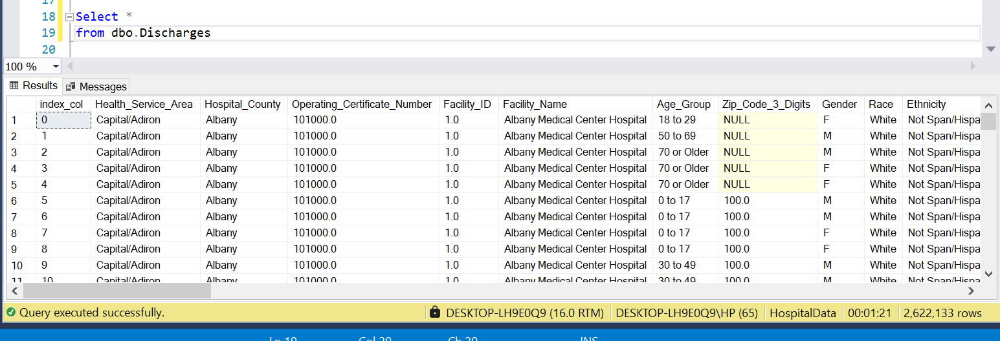
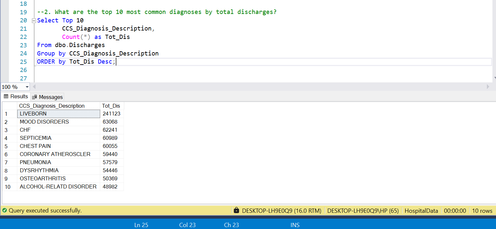
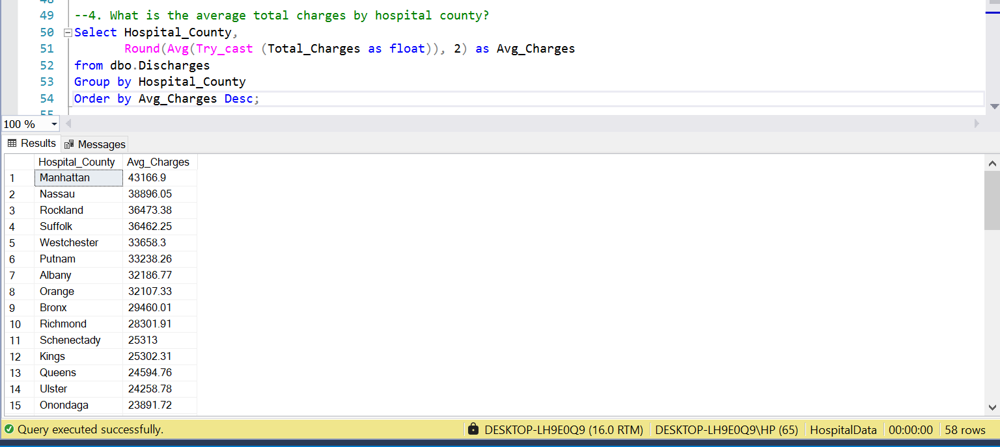
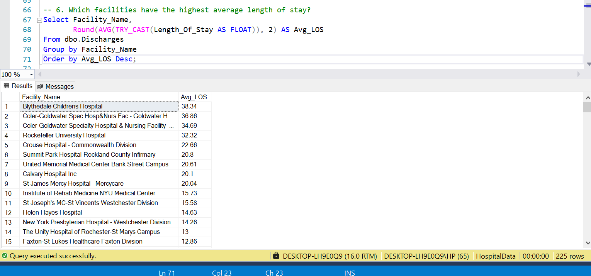
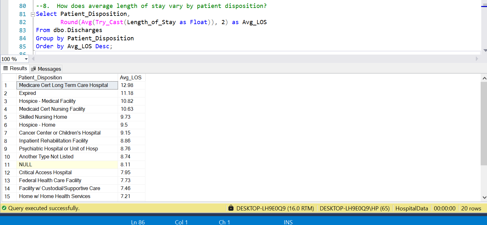
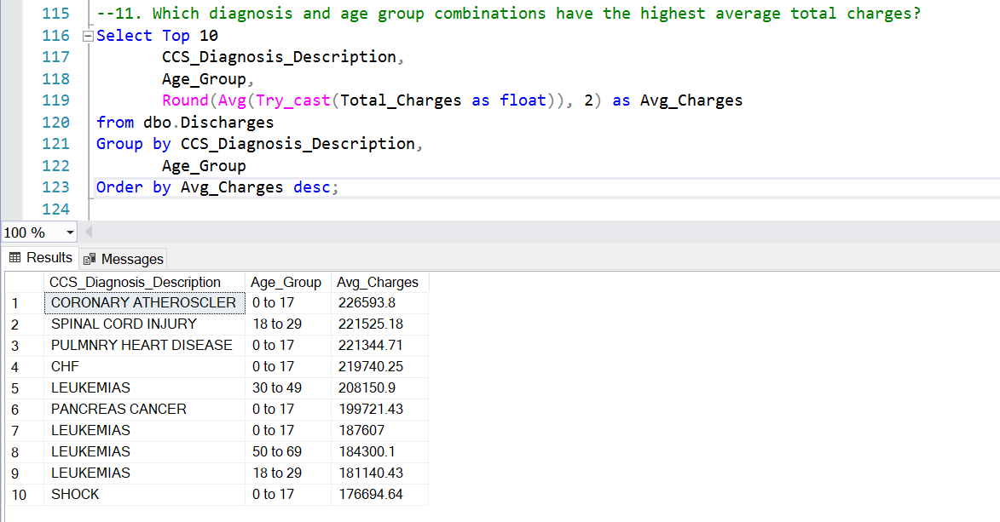
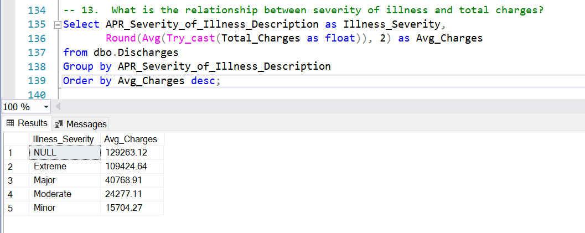
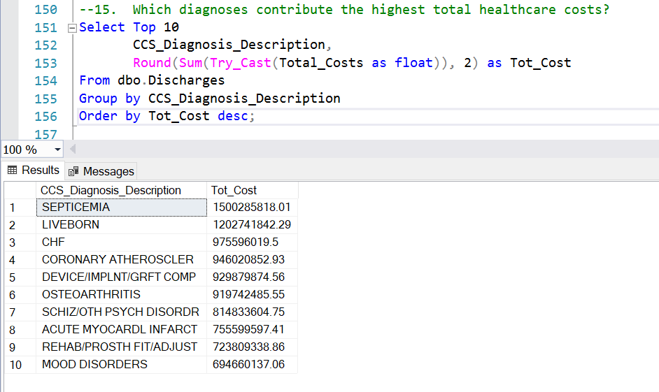
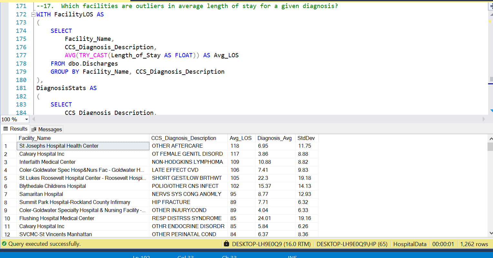
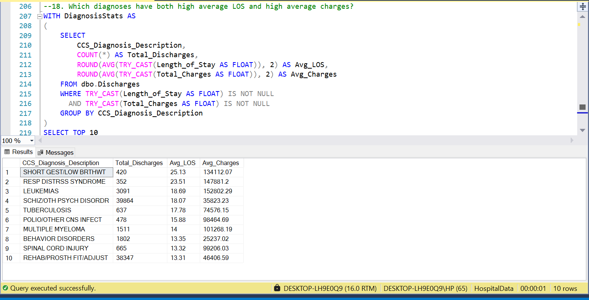

# Healthcare Operations Analysis Using SQL

## Project Highlights

- Analyzed 2.6M+ hospital discharge records using SQL Server
- Answered 19 business-focused healthcare analytics questions
- Performed descriptive, multidimensional, and advanced analytical queries
- Identified healthcare cost drivers, utilization trends, and LOS patterns
- Applied outlier detection using standard deviation analysis
- Generated operational insights relevant to healthcare decision-making

---

## Visual Insights

### Dataset Overview
Shows the structure of the healthcare discharge dataset used throughout the analysis.



---

### Top Diagnoses by Total Discharges
Identifies the most common conditions driving hospital utilization.



---

### Average Charges by Hospital County
Highlights geographic variation in healthcare costs across New York State.



---

### Facilities with the Highest Average Length of Stay
Benchmarks hospitals based on patient length of stay.



---

### Length of Stay by Patient Disposition
Shows how discharge destination influences hospitalization duration.



---

### Diagnosis and Age Group Combinations with Highest Charges
Examines which patient populations generate the highest healthcare charges.



---

### Severity of Illness vs Total Charges
Demonstrates the strong relationship between illness severity and healthcare spending.



---

### Diagnoses Contributing the Highest Total Healthcare Costs
Identifies the conditions responsible for the largest overall financial burden.



---

### Length of Stay Outlier Detection
Uses statistical analysis to identify facilities with unusually high LOS compared to diagnosis averages.



---

### Diagnoses with Both High LOS and High Charges
Highlights resource-intensive diagnoses that may require operational review.



## Project Overview

This project analyzes over **2.6 million hospital discharge records** using SQL Server to uncover trends in healthcare utilization, patient outcomes, costs, diagnosis patterns, payer performance, and facility-level operations.

The goal was to simulate the type of exploratory and operational analysis performed by healthcare data analysts and business intelligence teams to support decision-making within hospitals and healthcare systems.

---

## Dataset

**Source:** Kaggle Healthcare Discharge Dataset

**Size:** ~2.6 Million Records

**Database:** SQL Server

### Key Fields

- Length of Stay (LOS)
- Total Charges
- Total Costs
- Diagnosis Description
- Procedure Description
- Hospital County
- Facility Name
- Age Group
- Gender
- Race
- Admission Type
- Patient Disposition
- Primary Payer
- Severity of Illness

---

## Data Import Process

Due to the large size of the dataset and text fields containing embedded commas, the standard SQL Server Import Wizard was not suitable.

The data was successfully loaded using SQL Server's BULK INSERT functionality.

```sql
BULK INSERT Discharges
FROM 'medical11.csv'
WITH (
    FORMAT = 'CSV',
    FIRSTROW = 2,
    FIELDQUOTE = '"',
    ROWTERMINATOR = '0x0a',
    TABLOCK
);
```

---

## Business Questions Answered

### Descriptive Analysis

1. What is the average length of stay by diagnosis?
2. What are the most common diagnoses by discharge volume?
3. What is the patient distribution by age group?
4. What are the average hospital charges by county?
5. What is the discharge distribution by gender?
6. Which facilities have the highest average length of stay?
7. What are the average charges by primary payer?
8. How does LOS vary by patient disposition?
9. What are the most common procedures?
10. How does LOS differ between emergency and non-emergency admissions?

### Multi-Dimensional Analysis

11. Which diagnosis and age group combinations have the highest average charges?
12. How do charges vary across race and payer combinations?
13. What is the relationship between illness severity and hospital charges?
14. How are discharges distributed across admission types and medical/surgical categories?
15. Which diagnoses contribute the highest total healthcare costs?
16. Which primary payers are associated with the highest average LOS?

### Advanced Analytics

17. Which facilities are outliers in average LOS for specific diagnoses?

### Business & Operational Insights

18. Which diagnoses have both high LOS and high average charges?
19. Which counties generate the highest discharge volume and healthcare spending?

---

## Key Findings

### High Length of Stay Diagnoses

The longest average hospital stays were associated with:

| Diagnosis | Avg LOS (Days) |
|------------|------------|
| Short Gestation / Low Birth Weight | 25.13 |
| Respiratory Distress Syndrome | 23.51 |
| Leukemias | 18.69 |
| Schizophrenia & Other Psych Disorders | 18.07 |
| Tuberculosis | 17.78 |

These diagnoses often require complex treatment plans, specialized care, and extended monitoring.

---

### Most Common Diagnoses

The highest-volume diagnoses were:

| Diagnosis | Total Discharges |
|------------|------------|
| Liveborn | 241,123 |
| Mood Disorders | 63,068 |
| CHF | 62,241 |
| Septicemia | 60,989 |
| Chest Pain | 60,055 |

---

### Patient Age Distribution

Hospital utilization increased significantly with age.

| Age Group | Total Discharges |
|------------|------------|
| 70 or Older | 725,253 |
| 50 to 69 | 680,166 |
| 30 to 49 | 547,383 |
| 0 to 17 | 387,353 |
| 18 to 29 | 281,978 |

Older adults represented the largest portion of hospital discharges.

---

### Geographic Cost Variation

Counties with the highest average hospital charges included:

| County | Avg Charges |
|------------|------------|
| Manhattan | $43,166.90 |
| Nassau | $38,896.05 |
| Rockland | $36,473.38 |
| Suffolk | $36,462.25 |
| Westchester | $33,658.30 |

Manhattan hospitals generated the highest average charges per discharge.

---

### Severity of Illness and Cost

A strong relationship exists between illness severity and healthcare spending.

| Severity | Avg Charges |
|------------|------------|
| Extreme | $109,424.64 |
| Major | $40,768.91 |
| Moderate | $24,277.11 |
| Minor | $15,704.27 |

As severity increases, hospital charges rise dramatically.

---

### Emergency vs Non-Emergency Admissions

| Admission Type | Avg LOS |
|------------|------------|
| Emergency | 5.77 |
| Non-Emergency | 4.76 |

Emergency admissions stayed approximately 21% longer on average.

---

### Diagnoses Driving Healthcare Costs

The diagnoses responsible for the highest total healthcare costs were:

| Diagnosis | Total Cost |
|------------|------------|
| Septicemia | $1.50 Billion |
| Liveborn | $1.20 Billion |
| CHF | $975 Million |
| Coronary Atherosclerosis | $946 Million |
| Device/Implant Complications | $930 Million |

These conditions represent major drivers of healthcare spending.

---

### Payer Performance

Patients covered by Medicare experienced the longest average hospital stays among major payers.

| Primary Payer | Avg LOS |
|------------|------------|
| Medicare | 6.62 |
| Other Non-Federal Program | 6.59 |
| Medicaid | 6.22 |
| Self-Pay | 4.85 |
| Blue Cross | 4.22 |

---

### County-Level Utilization

Counties generating the highest hospital activity were:

| County | Total Discharges |
|------------|------------|
| Manhattan | 445,288 |
| Kings | 298,247 |
| Queens | 221,325 |
| Nassau | 215,831 |
| Bronx | 204,328 |

These counties represented the largest concentration of healthcare utilization.

---

### Facility Outlier Analysis

Using standard deviation analysis, several facilities were identified as significant LOS outliers when compared with diagnosis-specific averages.

Examples included:

- St Josephs Hospital Health Center
- Calvary Hospital Inc
- Interfaith Medical Center
- Blythedale Childrens Hospital
- Summit Park Hospital-Rockland County Infirmary

These facilities demonstrated LOS values substantially higher than peer institutions treating similar diagnoses.

---

## SQL Skills Demonstrated

### Data Aggregation

- COUNT()
- AVG()
- SUM()

### Data Cleaning

- TRY_CAST()
- Handling NULL values
- Importing large CSV datasets

### Querying Techniques

- GROUP BY
- ORDER BY
- CASE Statements
- TOP N Analysis

### Advanced SQL

- Common Table Expressions (CTEs)
- Standard Deviation Analysis
- Outlier Detection
- Multi-Dimensional Grouping

### Business Intelligence

- KPI Development
- Healthcare Cost Analysis
- Utilization Analysis
- Operational Performance Analysis

---

## Repository Structure

```text
Healthcare-Operations-Analysis-Using-SQL/
│
├── Healthcare_Discharge_Analysis.sql
├── README.md
└── screenshot/
```

---

## Tools Used

- SQL Server
- SQL Server Management Studio (SSMS)
- Kaggle
- GitHub

---

## Future Improvements

- Build an interactive Power BI dashboard
- Add trend analysis by year
- Create hospital benchmarking metrics
- Develop predictive LOS models using Python

---

## Author

**Oluwatosin Thomas**

Data Analyst | SQL | Python | Power BI | Business Intelligence
